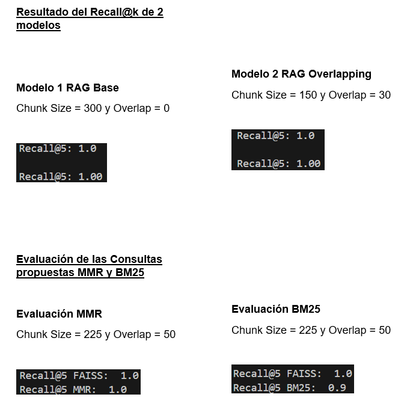

# **T4 Minería Multimedia: Proyecto RAG — (Retrieval-Augmented Generation)**


Este repositorio contiene código para construir y evaluar flujos RAG sobre un conjunto de documentos locales. Incluye variantes: RAG base, RAG con overlapping, selección MMR para diversificar la recuperación y evaluaciones comparativas (recall@k).

La entrega del trabajo contiene el código para construir y evaluar un sistema RAG sobre documentos locales, propiamente informes de perpectivas e insights. Los 3 archivos tienen estas temáticas:

* Existe una burbuja financiera por el boom de la Inteligencia Artificial

* Perspectivas sobre el mercado laboral de Estados Unidos

* Una mirada general a las valoraciones del mercado y análisis de los activos teniendo en cuenta los 2 previos temas tratados (El Boom de IA y el Mercado Laboral)


## 1) Requisitos y configuración del entorno

La configuración la hice localmente con Powershell:

1. Crear y activar un entorno virtual:

```powershell
python -m venv .venv
.\.venv\Scripts\Activate.ps1
```

2. Instalar dependencias:

```powershell
pip install -r requirements.txt
```

3. Configurar credenciales de Azure OpenAI (usado para generar embeddings):

Crear un archivo `.env` en la raíz del proyecto con las variables. El código utiliza `python-dotenv` para cargar esas variables:

```
AZURE_API_KEY
AZURE_ENDPOINT
```


## 2) Estructura del proyecto y descripción de archivos

- `Datos/` — carpeta donde se guardan los PDFs con los que se trabajó(`Documentos/`), los chunks y los índices FAISS (`Chunks/`, `Indices/`).
- `Modelos/` — implementaciones de los distintos pipelines RAG:
	- `rag_base.py` — pipeline base: genera chunks (sin overlapping), crea embeddings y construye un índice FAISS.
	- `rag_overlap.py` — pipeline con overlapping en el chunking.
	- `Datos_Modelos/` — subcarpeta usada por algunos scripts para almacenar outputs de modelos (chunks e índices).
- Scripts de utilidad / evaluación en la raíz:
	- `rag_pipeline.py` — orquestador para ejecutar pipelines. Es el archivo que permite la generación de texto con el modelo GPT para consultas.
	- `rag_MMR_evaluacion.py` — implementación de la selección MMR y se evalua el desempeño con consultas.
	- `rag_BM25_evaluacion.py` — implementación de BM25 y se evalua el desempeño con consultas.
	- `evaluacion.py` — script general de evaluación para la métrica de Recall@k.
	
    - Los archivos inciiales que permitieron de desarrollo del sistema RAG son busqueda y preprocesamiento, son parte fundamental del proyecto y son claves para el MMR y el BM25.

        - `busqueda.py` — Carga los archivos .parquet con los chunks y el índice FAISS creado previamente - Obtiene los embeddings de la consulta - Busca los chunks más similares en el índice FAISS, los top k (5 generalmente) - Prueba con una consulta de ejemplo y muestra los chunks más similares encontrados.
        - `preprocesamiento.py` — Recolecta PDFs de Datos/Documentos - Extrae el texto de cada archivo - Hace chunking con tamaño fijo y overlapping (por defecto) - Genera embeddings usando AzureOpenAI - Guarda todos los chunks + embeddings - Crea un índice FAISS. 

Archivos generados por los scripts :
- `Datos/Chunks/*.parquet` — chunks serializados con su embedding 
- `Datos/Indices/*.faiss` — índices FAISS generados 

## 3) Cómo ejecutar los flujos (pasos típicos)

1. Generar chunks y crear índice FAISS (ejemplo base):

```powershell
python Modelos\rag_base.py
```

2. Ejecutar pipeline con overlapping:

```powershell
python Modelos\rag_overlap.py
```

3. Ejecutar la evaluación MMR (genera parquet e índice y calcula recall@k):

```powershell
python rag_MMR_evaluacion.py
```

4. Ejecutar evaluación BM25:

```powershell
python rag_BM25_evaluacion.py
```

Como la interacción es por consola, las consultas de estos se hacen por ahi mismo, al igual que la salida de la métrica para cada script,

## 4) Detalle de la evaluación (Recall@k)

- Métrica principal: recall@k — para cada query se comprueba si el documento esperado aparece entre los primeros k (k = 5) resultados. El script devuelve el promedio sobre todas las queries.
- Scripts de evaluación: `rag_MMR_evaluacion.py` y `rag_BM25_evaluacion.py` (compara FAISS puro, FAISS+MMR y BM25). Las consultas para la evaluación están en la variable `queries_evaluacion` dentro de cada archivo para cambiar/añadir consultas y su `documento_esperado`.

Resultados de ejecución (resumen de métricas):


 


## 6) ¿Que más se podría hacer luego?

- Guardar resultados de evaluación (ya sea en CSV o JSON) y tenerw  curvas con distintos parámetros (k, pesos MMR) para análisis posterior.
- Añadir soporte opcional para usar embeddings locales o modelos distintos a AzureOpenAI.
- Implementar un apartado para utils y poder reutilziar módulos y funciones hechas ya que en están repetidas (principalemnte las de preprocesamiento, busqyeda y evaluación).